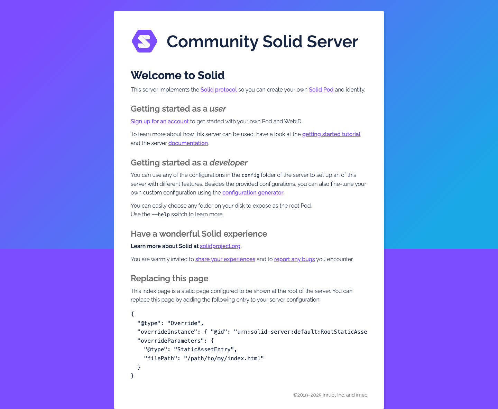

# learn.md

## 作用范围

- 这个文件只记录 CSS 相关的学习、实验、样式实现和样式排查。
- 非 CSS 的操作，例如服务启动、harness 初始化、项目记忆维护，记录到 `.effective-harnesses/agent-progress.md`。

## 记录规则

- 这是 CSS 学习项目的专项操作日志。
- 每次有实际的 CSS 相关操作后，都要追加一条真实记录。
- 每条记录至少包含：要做的事、执行的命令、得到的结果、出现的问题、解决的方法。
- 每条记录都要包含 `tags` 标签数组，用来标记主题；可同时使用多个标签。
- 关键网页、关键结果或关键报错，尽量同时保存截图到 `screenshots/YYYY-MM-DD/`，并把截图路径写进对应记录。
- 默认优先保存不带红框的 clean 截图，只有在排查交互元素或定位问题时才临时使用 annotated 截图。
- 如果多条记录引用同一张截图，优先在第一次出现时内嵌图片，后续记录只写“复用截图：`相对路径`”即可，避免同一张图在文档里重复展开。
- 如果同一批截图已经在一条总结性记录中集中展示，前面的单条记录默认只保留路径说明，不重复插图。
- 记录内容必须直接和 Solid、CSS、配置理解、资源内容、页面结果、报错现象或调试结论有关。
- 纯粹的日志维护、截图整理、Markdown 格式调整、去重规则调整，这类元操作不写进 `learn.md`，改记到 `.effective-harnesses/agent-progress.md`。
- 如果只是调研，没有报错，也要把“未出现问题”写清楚。

## 标签规范

- 标签使用数组格式，例如：`["概念", "配置", "身份"]`
- 标签尽量短，优先复用已有标签，避免同义重复。
- 标签固定区分大小写，必须复用既定写法，不能混用 `bug`、`Bug`、`BUG` 这类变体。
- 当前推荐词表包括且不限于：`概念`、`配置`、`命令`、`身份`、`WebID`、`OIDC`、`Turtle`、`页面`、`截图`、`调试`、`BUG`、`报错`、`版本兼容`
- 如果现有词表里已经有含义接近的标签，必须优先复用，不新增同义标签。
- 只有在现有标签明显不够用时才新增标签；新增时保持短词、单一含义，并沿用当前大小写风格。
- 如果一条记录同时包含知识理解和问题排查，可以同时打上 `概念` 和 `BUG`

## 记录模板

### YYYY-MM-DD HH:MM TZ - 标题

- tags: `["标签1", "标签2"]`
- 要做的事：
- 执行的命令：
- 得到的结果：
- 出现的问题：
- 解决的方法：
- 相关截图：

### 截图压缩规则

- 首次引用某张关键截图时，使用 Markdown 图片直接插入。
- 后续再次引用同一张图时，不重复插图，只写：`复用截图：screenshots/YYYY-MM-DD/xxx.png`
- 如果一条记录已经汇总展示了多张图，前面相关步骤只保留文字引用，把图片集中放在汇总记录里。
- 优先保留最能说明问题的一张图，避免同一页面同时保留多个近似截图。

## CSS 记录

- 2026-04-29：当前还没有 CSS 相关操作记录；后续从第一条实际 CSS 学习或实现开始追加。

## 补充记录

### 2026-04-29 00:37 CST - 在非沙盒环境启动本地 Solid Community Server

- tags: `["命令", "配置", "页面"]`
- 要做的事：使用 `./my-local-pod` 作为数据目录，在非沙盒环境启动 `@solid/community-server` 并保持常驻运行。
- 执行的命令：`npx @solid/community-server -c @css:config/file.json -f ./my-local-pod`
- 得到的结果：服务成功启动；日志显示监听地址为 `http://localhost:3000/`；启动后的长驻 PTY 会话 ID 为 `93999`。
- 出现的问题：启动日志出现运行时警告，提示 `oidc-provider` 当前 Node 版本不是推荐的 LTS，建议使用 `Node.js v22.x LTS` 或更高 LTS。
- 解决的方法：该警告没有阻塞服务启动，先保留当前环境继续学习；如果后续出现兼容性问题，再切换到 Node.js 22 LTS 后重启服务。
- 相关截图：`screenshots/2026-04-29/css-home-clean.png`，补拍于 2026-04-29 01:30 CST，用于记录服务成功启动后的首页状态。
  

### 2026-04-29 00:49 CST - 理解 Community Solid Server 的开发者入门说明

- tags: `["概念", "配置", "命令"]`
- 要做的事：理解 “Getting started as a developer” 这段说明，弄清楚配置文件、根 Pod 目录和 `--help` 的含义。
- 执行的命令：未执行命令；本次是阅读和解释文档说明。
- 得到的结果：明确了可以从 `config` 文件夹里的现成配置启动服务器，也可以通过配置生成器自定义配置；还明确了可以把本地任意文件夹作为根 Pod 目录暴露出去；`--help` 用来查看更多启动参数和说明。结合当前项目，`-c @css:config/file.json` 表示使用官方提供的文件系统配置，`-f ./my-local-pod` 表示把当前项目下的 `my-local-pod` 作为根 Pod 目录。
- 出现的问题：未出现问题。
- 解决的方法：不需要额外处理；后续如果要比较不同配置的差异，可以继续查看 `config` 目录或运行带 `--help` 的命令。
- 相关截图：`screenshots/2026-04-29/css-home-clean.png`，其中包含首页上 “Getting started as a developer” 的页面内容。
  复用截图：`screenshots/2026-04-29/css-home-clean.png`

### 2026-04-29 01:01 CST - 使用配置生成器输出启动本地 Solid Community Server

- tags: `["配置", "命令", "BUG", "版本兼容"]`
- 要做的事：把在线配置生成器生成的 JSON 保存到项目中，并用它替换原先的默认配置启动本地 Solid Community Server。
- 执行的命令：`apply_patch`
- 执行的命令：向旧的长驻会话发送 `Ctrl-C` 以停止原服务
- 执行的命令：`npx @solid/community-server -c ./my-config.json -f ./my-local-pod`
- 执行的命令：`sed -n '1,80p' /Users/ansvver/.npm/_npx/519be4cd80562143/node_modules/@solid/community-server/config/file.json`
- 执行的命令：`rg -n 'context.jsonld|@context' /Users/ansvver/.npm/_npx/519be4cd80562143/node_modules/@solid/community-server/config -g '*.json'`
- 执行的命令：`curl -s -o /dev/null -w '%{http_code}\n' http://127.0.0.1:3000/`
- 得到的结果：将在线生成的配置保存为项目根目录下的 `my-config.json`；修正后使用新命令成功启动服务；日志显示监听地址为 `http://localhost:3000/`；新的长驻 PTY 会话 ID 为 `30213`；本地访问返回 `200`。
- 出现的问题：第一次直接用生成器给出的配置启动失败，报错说明 `my-config.json` 中的 `@context` 指向 `@solid/community-server/^7.0.0`，而当前 `npx` 实际运行的是 8.x，导致配置解析失败。
- 解决的方法：对照当前安装包里的官方配置，确认配置路径仍兼容后，把 `my-config.json` 的 `@context` 从 `^7.0.0` 改为 `^8.0.0`，然后重新启动；同时把持久化启动命令同步更新到 `.effective-harnesses/init.sh` 和项目记忆。
- 相关截图：`screenshots/2026-04-29/css-home-clean.png`，补拍于修正 `@context` 并成功重启之后，用于记录新配置启动成功的页面结果。
  复用截图：`screenshots/2026-04-29/css-home-clean.png`

### 2026-04-29 01:14 CST - 理解 `profile/card#me` 文件表达的身份信息

- tags: `["概念", "身份", "WebID", "OIDC", "Turtle"]`
- 要做的事：理解 `http://localhost:3000/ansvver-pod/profile/card#me` 对应的 Turtle 内容，弄清楚文档本身、`#me`、WebID 和 OIDC issuer 分别表示什么。
- 执行的命令：未执行命令；本次是阅读资源内容并做语义解释。
- 得到的结果：明确了 `/ansvver-pod/profile/card` 是个人资料文档，`#me` 是文档中表示“我”这个人的资源；`<> a foaf:PersonalProfileDocument` 表示当前文档是个人资料文档；`foaf:maker` 和 `foaf:primaryTopic` 都指向 `#me`，表示这个文档由 `#me` 创建，主要也是描述 `#me`；`<...#me> a foaf:Person` 表示 `#me` 是一个人；`solid:oidcIssuer <http://localhost:3000/>` 表示这个 WebID 对应的 OIDC 身份提供者是当前本地 CSS 服务。
- 出现的问题：容易把 `/profile/card` 和 `/profile/card#me` 混为一个资源。
- 解决的方法：区分“文档 URL”和“文档里的资源节点”这两个层次；浏览器真正向服务器请求的是 `/profile/card`，而 `#me` 只是客户端在文档内部定位到“我”这个节点的 fragment，不会单独发给服务器。
- 相关截图：`screenshots/2026-04-29/profile-card-document-clean.png`，展示了 `profile/card` 文档当前返回的 Turtle 内容。
  
